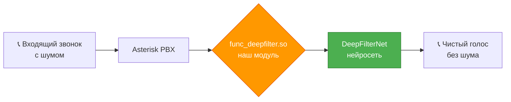
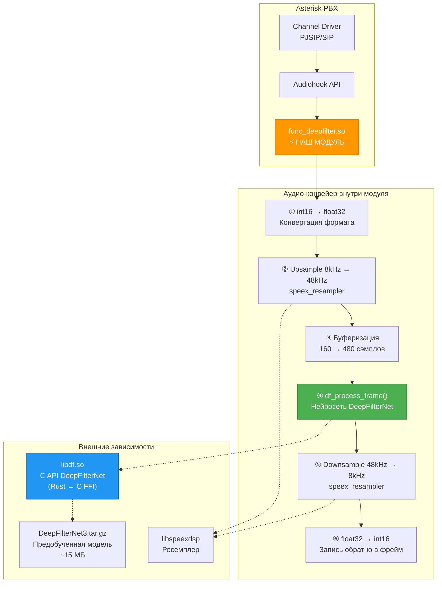
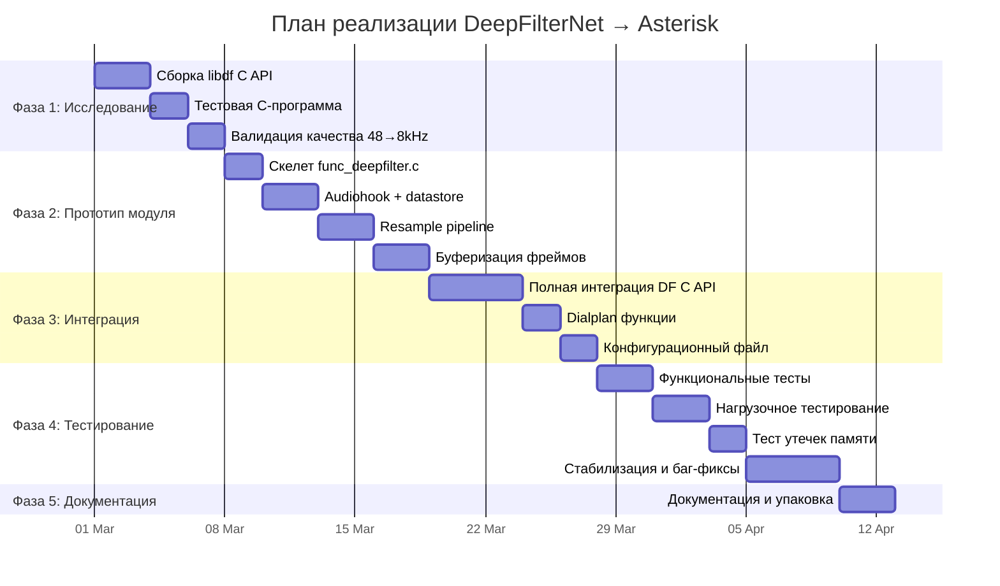
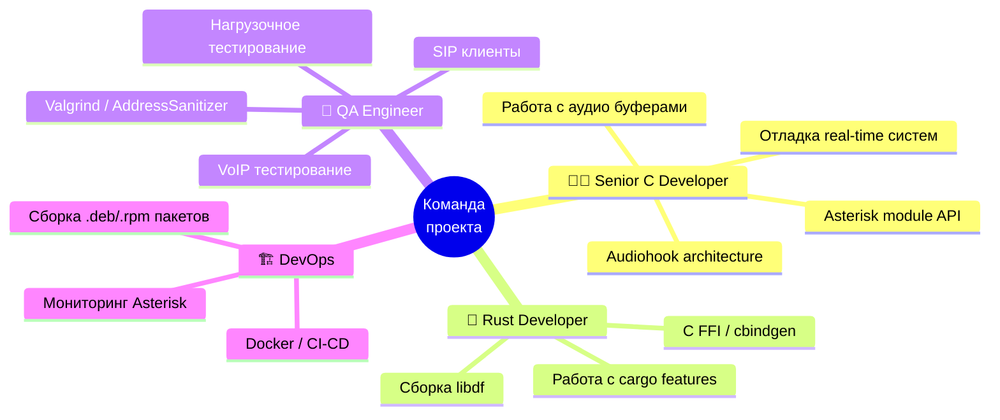
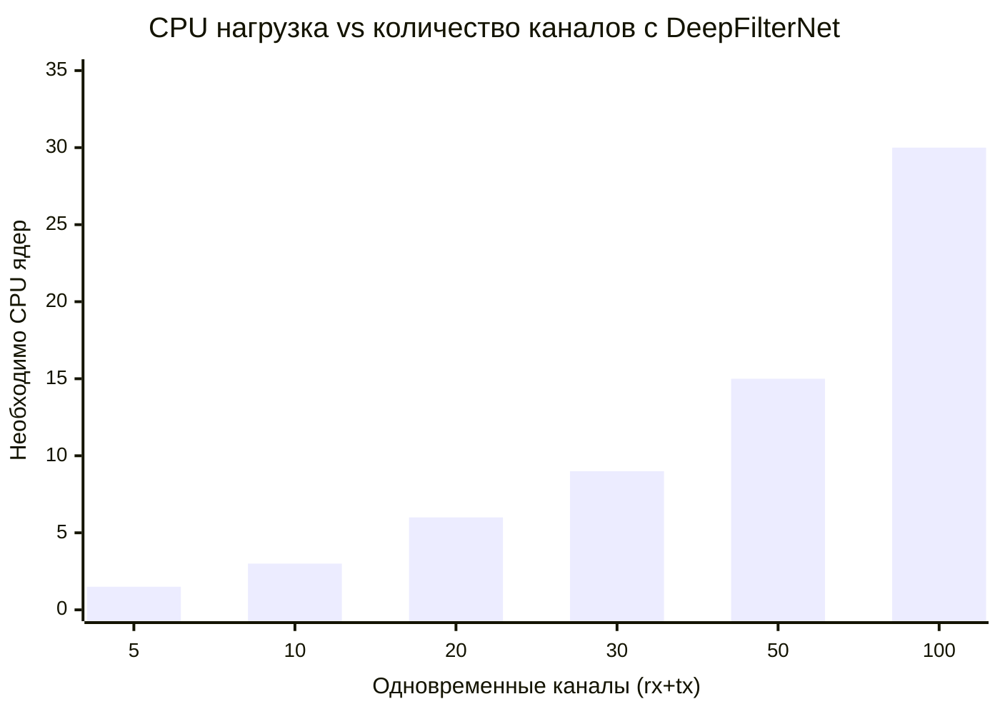
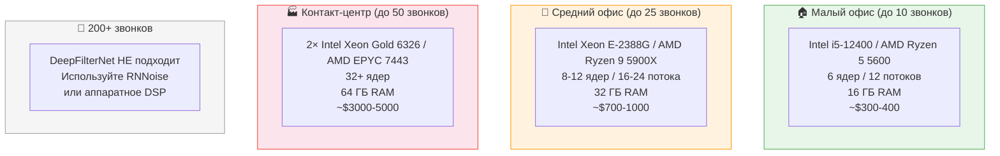
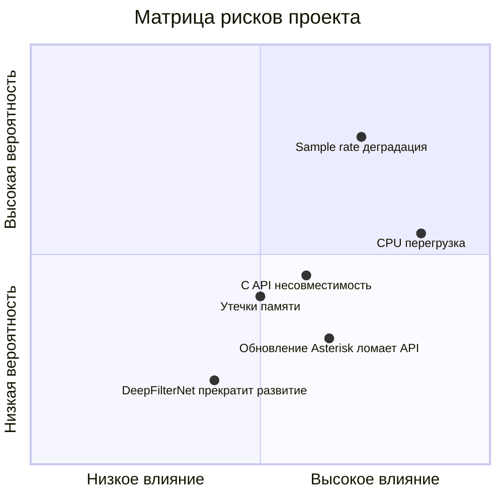
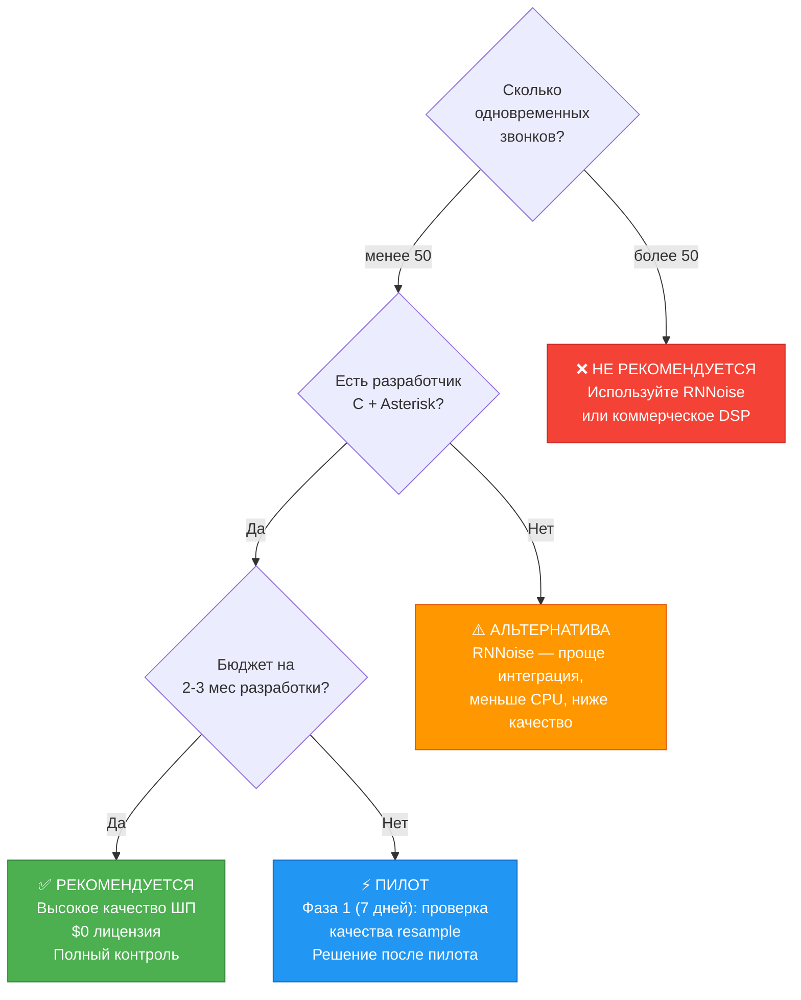

# Интеграция DeepFilterNet в Asterisk PBX
## Анализ трудозатрат, реалистичности и ресурсов

> **Дата:** Февраль 2026  
> **Тип документа:** Техническое обоснование для руководителя  
> **Статус:** Проект возможен, требует квалифицированных ресурсов

---

## 1. Суть проекта

Встраивание нейросетевого шумоподавления DeepFilterNet (открытый проект, MIT/Apache лицензия) в телефонную станцию Asterisk в качестве нативного модуля. Цель — кардинальное улучшение качества голосовой связи в шумных условиях по сравнению со штатным решением Speex.

---

## 2. Сравнение технологий

| Параметр | Speex (штатный) | DeepFilterNet | RNNoise (альтернатива) |
|----------|:-:|:-:|:-:|
| Качество шумоподавления | ⭐⭐ | ⭐⭐⭐⭐⭐ | ⭐⭐⭐⭐ |
| CPU на 1 канал | ~0.5% ядра | ~30% ядра | ~1% ядра |
| Латентность | ~5 мс | ~45 мс | ~10 мс |
| Готовность к Asterisk | Встроен | Требует разработку | Требует разработку |
| Лицензия | BSD | MIT/Apache | BSD |
| Язык ядра | C | Rust + ONNX | C |
| Сложность интеграции | — | Высокая | Средняя |

---

## 3. Архитектура решения

---

## 4. Оценка трудозатрат

### 4.1 Разбивка по фазам

### 4.2 Сводная таблица трудозатрат

| Фаза | Задачи | Трудозатраты | Квалификация |
|------|--------|:---:|---|
| **1. Исследование** | Сборка libdf, тесты качества resample | **7 чел-дней** | Senior C/Rust |
| **2. Прототип** | Скелет модуля, audiohook, resample, буферы | **11 чел-дней** | Senior C + Asterisk |
| **3. Интеграция** | C API, dialplan, конфиг | **9 чел-дней** | Senior C + Asterisk |
| **4. Тестирование** | Функц., нагрузка, утечки, стабилизация | **13 чел-дней** | Middle+ QA/DevOps |
| **5. Документация** | README, примеры, упаковка | **3 чел-дней** | Any |
| | | | |
| **ИТОГО** | | **43 чел-дня** | **~2 месяца / 1 разработчик** |
| **С запасом (+30%)** | Непредвиденные проблемы | **56 чел-дней** | **~2.5 месяца** |

---

## 5. Необходимые компетенции

**Минимальная команда:** 1 Senior C-разработчик с опытом Asterisk + базовыми знаниями Rust.  
**Оптимальная команда:** 1 Senior C + 1 Middle Rust + 1 QA.

---

## 6. Требования к серверному оборудованию

### 6.1 CPU-нагрузка DeepFilterNet

> **Расчёт:** 1 канал DeepFilterNet ≈ 30% ядра CPU.  
> При обработке и rx и tx — это 60% ядра на вызов.

### 6.2 Сценарии нагрузки

| Сценарий | Одновр. звонков | Каналов DF | CPU ядер (DF) | CPU ядер (всего) | RAM |
|----------|:-:|:-:|:-:|:-:|:-:|
| **Малый офис** | 5 | 10 | 3 | 4 | 2 ГБ |
| **Средний офис** | 15 | 30 | 9 | 12 | 4 ГБ |
| **Контакт-центр** | 50 | 100 | 30 | 36 | 8 ГБ |
| **Крупный оператор** | 200+ | 400+ | 120+ | ❌ нереалистично | — |

### 6.3 Рекомендуемое оборудование

### 6.4 Сравнение стоимости владения

| Статья | DeepFilterNet | Коммерческий DSP | Speex (штатный) |
|--------|:-:|:-:|:-:|
| Лицензия | **$0** (MIT) | $5 000–50 000/год | **$0** |
| Доп. железо (25 звонков) | ~$700 | Спец. плата ~$2 000 | $0 |
| Качество | ⭐⭐⭐⭐⭐ | ⭐⭐⭐⭐⭐ | ⭐⭐ |
| Разработка интеграции | ~$15 000* | $0 (SDK) | $0 (встроен) |

> \* Оценка при ставке разработчика ~$75/час × 200 часов

---

## 7. Анализ рисков

### Детализация рисков

| # | Риск | Вероятность | Влияние | Митигация |
|:-:|------|:-:|:-:|---|
| 1 | **Деградация качества при resample 8↔48 kHz** | Высокая | Среднее | Тестирование до начала разработки. Fallback: работать только с G.722 (16 kHz) |
| 2 | **CPU-перегрузка при масштабировании** | Средняя | Высокое | Лимит каналов. Приоритетные очереди. Мониторинг CPU. Гибридный режим (DF для VIP, Speex для остальных) |
| 3 | **Несовместимость C API DeepFilterNet** | Средняя | Среднее | Feature "capi" может отсутствовать в новых версиях. Зафиксировать версию. Готовить fallback через LADSPA |
| 4 | **Утечки памяти в long-running процессе** | Средняя | Среднее | Valgrind/ASan тестирование. Периодический restart Asterisk |
| 5 | **Обновление Asterisk ломает audiohook API** | Низкая | Высокое | API стабилен 10+ лет. Фиксируем major version |
| 6 | **DeepFilterNet перестанет развиваться** | Низкая | Низкое | Модель уже обучена и работает автономно. MIT лицензия позволяет форк |

---

## 8. Решение GO / NO-GO

---

## 9. Рекомендация

### Для малого/среднего бизнеса (до 25 одновременных звонков)

**GO** — проект целесообразен при наличии квалифицированного C-разработчика.

Ключевые преимущества:
- Качество шумоподавления на уровне коммерческих решений стоимостью $10 000+/год
- Нулевые лицензионные платежи (MIT/Apache)
- Полный контроль над решением, нет vendor lock-in
- Современная нейросетевая технология

### Рекомендуемый план действий

1. **Неделя 1:** Пилот — собрать libdf, проверить качество resample на реальных записях
2. **По результатам пилота:** Решение о полной разработке
3. **Месяцы 1-2:** Разработка и тестирование модуля
4. **Месяц 3:** Стабилизация, документация, внедрение

### Альтернативы если DeepFilterNet избыточен

| Если... | То рассмотрите... |
|---------|-------------------|
| Нужно быстро и дёшево | **RNNoise** — C, 1% CPU, среднее качество, проще интеграция |
| Нужен enterprise-grade | **Коммерческое DSP** (Oasis, Dolby.io) — дорого, но поддержка |
| Нужно для 100+ каналов | **GPU-ускорение** (DeepFilterNet + PyTorch на CUDA) через ARI |
| Нет разработчиков | **LADSPA через PipeWire** — без модификации Asterisk, ОС-уровень |

---

*Документ подготовлен на основе анализа исходного кода Asterisk (func_speex.c, audiohook.h), документации DeepFilterNet (C API, LADSPA plugin), и практического опыта интеграции аудио-обработки в VoIP системы.*
